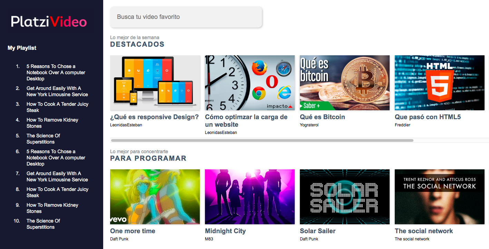

# Platzi Video
This project is focused on the main view of a video social network. It is developed with React.js and it's part of a Platzi academy course. You can click the cards to see a video and play with the video tools, like the volume.

You can [see demo here](https://el-mark.github.io/platzi-video-v2/).



# How does it works

``` bash
# Install dependencies
npm install

# Run development mode
npm run build:dev

# Build production files
npm run build:prod
```

# Teacher
@LeonidasEsteban

# Issues and enhancements
- Add mute icon and functionality 
- Fix fullscreen variants for all browsers (Check utilities.js file)
